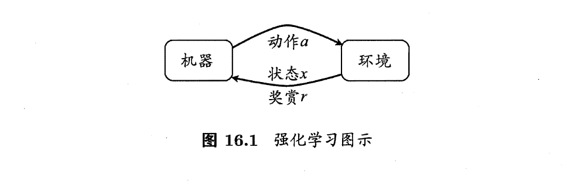
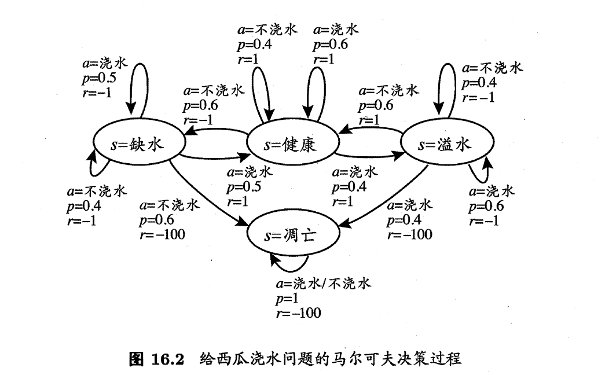
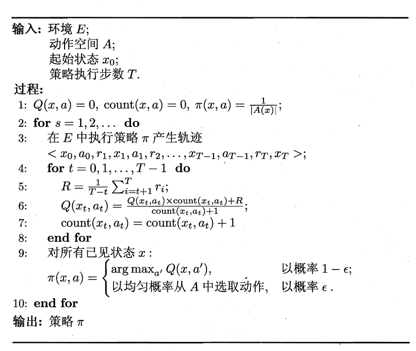
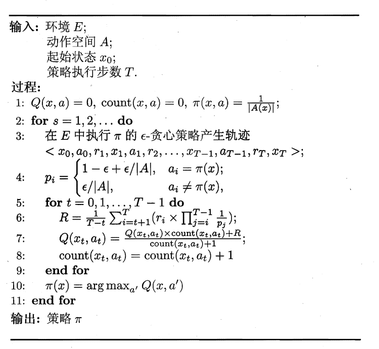
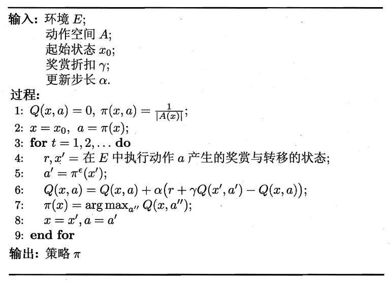
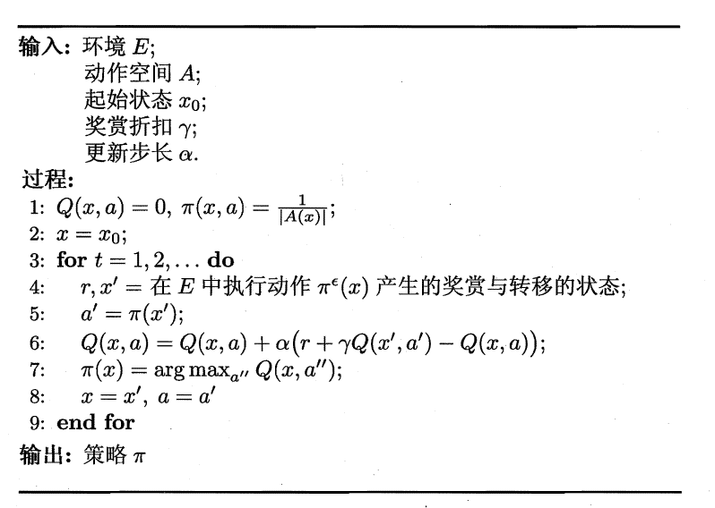

# 
 Reinforcement Learning Knowledge Memo 

[toc]

## 0. 写在前面

## 1. 强化学习定义
一个强化学习任务可以用四元组$E = <X,A,P,R>$表示，其中：
$X$是状态空间，每个状态$x \in X$是机器感知到的环境的描述
$A$是动作空间，每个动作$a \in A$是机器在环境中所能采取的动作。
$ P : X \times A \times X \mapsto \Bbb{R}$指定了状态转移概率;
$ R : X \times A \times X \mapsto \Bbb{R}$指定了奖赏
当某个动作$a$作用在状态$x$上时，潜在的转移概率$P$将使环境从当前状态按某概率转移到另一个状态，在状态发生移转的同时，环境会根据潜在的奖赏(reward)函数$R$反馈给机器一个奖励。

## 2. K-摇臂赌博机

## 3. 有模型学习
考虑多步强化学习任务3 暂且先假定任务对应的马尔可夫决策过程四元组$E=<X,A,P,R>$ 均为己知，这样的情形称为“模型已经”，即机器对环境进行了建模，能在机器内部模拟出与环境相同或近似的状况。在己知模型的环境中学习称为"有模型学习" (model-based learning)。此时，对于任意状态和动作$a$，在$x$状态下执行动作$a$转移到状态$x'$的概率$P^{a}_{x \mapsto x'}$ 是己知的，该转移所带来的奖赏$R^{a}_{x \mapsto x'}$也是已知的。为便于讨论,不妨假设状态空间$X$和动作空间$A$均为有限.

## 4. 免模型学习

在实际的强化学习任务中，环境的转移概率、奖赏函数往往很难得知，甚至很难知道环境中一共有多少状态，若学习算法不依赖于环境建模，则称为“免模型学习”(model-free learning),这比有模型学习要困难得多。

### 4.1 蒙特卡罗强化学习

在免模型情形下，策略迭代算法首先遇到的问题是策略无法评估，这是由于模型未知而导致无法做全概率展开。此时只能通过在环境中执行选择的动作，来观察转移的状态和得到的奖赏.受$K$摇臂赌博机的启发，一种直接的策略评估替代方法是多次"采样"，然后求取平均累积奖赏来作为期望累积奖赏的近似，这称为蒙特卡罗强化学习。由于采样必须为有限次数，因此该方法更适合于使用$T$步累积奖赏的强化学习任务。

&emsp;&emsp;另一方面， 策略迭代算法估计的是状态值函数$V$， 而最终的策略是通过状态-动作值函数$Q$来获得。当模型己知时，从$V$到$Q$有很简单的转换方法，而当模型未知时，这也会出现困难。于是，我们将估计对象从$V$转变为$Q$，即估计每一对"状态-动作"的值函数。

具体算法如下

还有异策略蒙特卡罗算法

### 4.2 时序差分学习

&emsp;&emsp;蒙特卡罗强化学习算法通过考虑采样轨迹，克服了模型未知给策略估计造成的困难.此类算法需在完成一个采样轨迹后再更新策略的值估计,而前而介绍的基于动态规划的策略迭代和值迭代算法在每执行一步策略后就进行值函数更新.两者相比，蒙特卡罗强化学习算法的效率低得多，这里的主要问题是蒙特卡罗强化学习算法没有充分利用强化学习任务的MDP结构.时序主分 (Temporal Difference，简称TD)学斗则结合了动态规划与蒙特卡罗方法的思想，能做到更高效的免模型学习.

蒙特卡罗强化学习算法的本质，是通过多次尝试后求平均未作为期望累积奖赏的近似，但它在求平均时是"批处理式"进行的，即在一个完整的采样轨迹完成后再对所有的状态-动作对进行更新.实际上这个更新过程能增量式进行.对于状态-动作对$(x,a)$ ，不妨假远基于t 个采样己估计出值函数$Q^{\pi}_{t}(x,a)=\frac{1}{t} \sum^{t}_{i=1}r_i$， 则在得到第t+1 个采样$r_{t+1}$时，类似式(16.3),有
$$
Q^{\pi}_{t+1}(x,a) = Q^{\pi}_{t}(x,a)+\frac{1}{t+1}\left( r_{t+1} - Q^{\pi}_{t}(x,a)\right)
$$

显然，只需给$Q^{\pi}_{t}(x,a)$加上增量击$\frac{1}{t+1}(r_{t+1}-Q^{\pi}_{t}(x,a))$即可。更一般的，将$\frac{1}{t+1}$替换为系数$\alpha_{t+1}$,则可将增量项写作$\alpha_{t+1}(r_{t+1}-Q^{\pi}_{t}(x,a))$.在实践中通常令$\alpha_{t}$为一个较小的正数值$\alpha$，若将$Q^{\pi}_{t}(x,a))$展开为每步累积奖赏之和，则可看出系数之和为1 ，即令$\alpha_{t}=\alpha$,不会影响$Q_t$是累积奖赏之和这一性质.更新步长$\alpha$越大,则越靠后的累积奖赏越重要.

以$\gamma$折扣累积奖赏为例,利用动态规划方法且考虑到模型未知时使用状态-动作值函数更方便,有
$$
\begin{aligned}
Q^{\pi}(x,a) &= \sum P^{a}_{x \mapsto x'}(R^{a}_{x \mapsto x'}+\gamma V^{\pi}(x')) \\
&= \sum P^{a}_{x \mapsto x'}(R^{a}_{x \mapsto x'}+\gamma \sum_{a' \in A}\pi(x',a')Q^{\pi}(x',a'))
\end{aligned}
$$
通过增量求和可得
$$
Q^{\pi}_{t+1}(x,a) = Q^{\pi}_{t}(x,a)+\alpha\left( R^{a}_{x \mapsto x'}+\gamma Q^{\pi}_{t}(x',a') - Q^{\pi}_{t}(x,a)\right)
$$
其中$x'$是前一次在状态$x$执行动作$a$后转移到的状态， $a'$是策略$\pi$在$x'$上选择的动作.

使用上式每执行一步策略就更新一次值函数估计，于是得到下图的算法.该算法由于每次更新值函数需知道前一步的状态(state) 、前一步的动作(action)、奖赏值(reward) 、当前状态(state) 、将要执行的动作(action)，由此得名为Sarsa算法. 显然Sarsa是一个同策略算法，算法中评估(第6行)、执行(第5行)的均为${\epsilon}$-贪心策略.

将Sarsa修改为异策略算法，则得到下图描述的Q-学习(Q-learning)算法，该算法评估(第6 行)的是$\epsilon$-贪心策略，而执行(第5行)的是原始策略.
